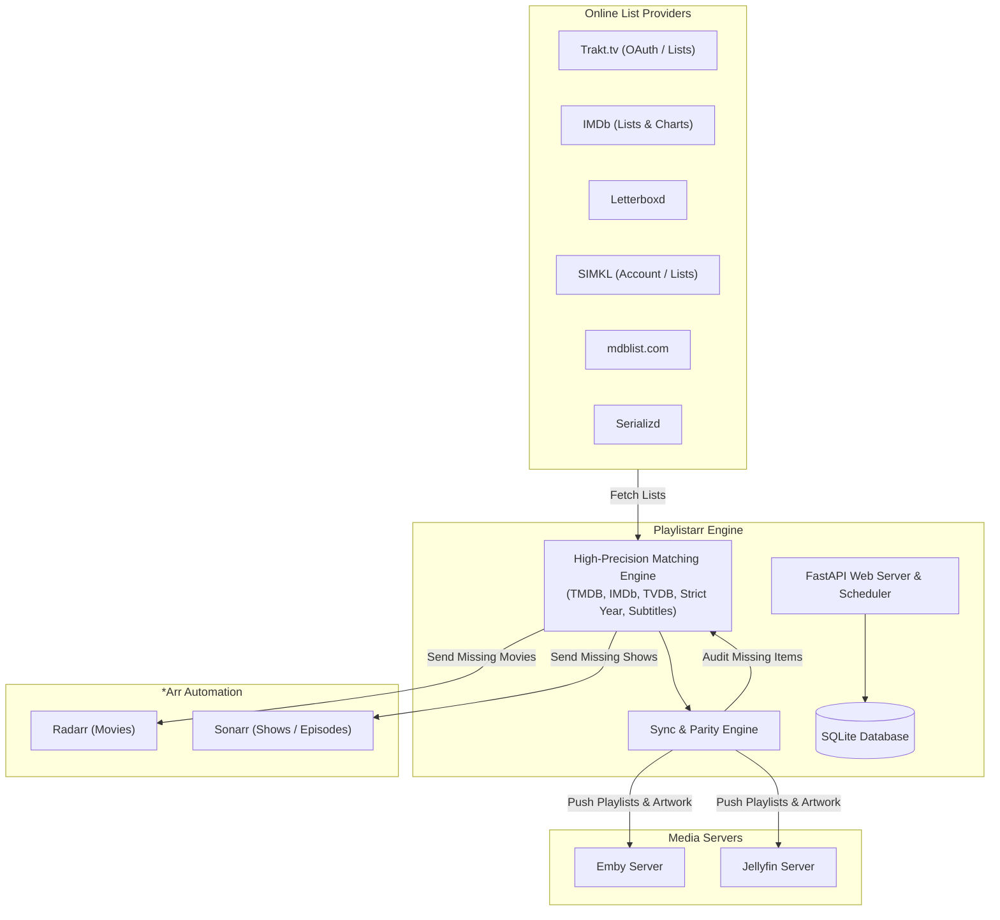

# Playlistarr 🎬✨

[](https://github.com/EatPrilosec/Playlistarr)
[](LICENSE)
[](https://www.python.org/)
[](https://react.dev/)
[](https://paypal.me/DVDIsDead)

**Playlistarr** is a modern, standalone web application and background synchronization engine that mirrors movie & TV playlists from **Trakt**, **IMDb**, **Letterboxd**, **SIMKL**, **mdblist**, and **Serializd** directly into your **Emby** and **Jellyfin** media servers.

It also integrates seamlessly with **Sonarr** and **Radarr** to automatically identify missing playlist items in your library and send them for automated downloading with 1 click.

---

## ⚡ Key Features

- **🌐 Multi-Provider List Ingestion**:
  - **Trakt**: Full support for user custom lists, official lists, and watchlists. Includes interactive **Device Code OAuth** flow for private lists and VIP access.
  - **IMDb**: Custom lists, search results, and top charts (e.g. IMDb Top 250) with automated multi-page scraping.
  - **Letterboxd**: Ranked lists, film diaries, and curated collections.
  - **SIMKL**: User custom lists, watchlist, and trending feeds with built-in Cloudflare challenge handling and account connectivity.
  - **mdblist**: Dynamic smart filters and curated multi-source lists.
  - **Serializd**: TV show journals and season/series watch orders.

- **🤖 Sonarr & Radarr Media Automation**:
  - Connect your existing **Radarr** and **Sonarr** instances in Settings with live connectivity testing.
  - Automatically discovers available **Root Folders** and **Quality Profiles**.
  - **Matches Inspection Modal**: Inspect exactly which items in a playlist are matched or missing on each connected server.
  - **1-Click Batch Automation**: "Add Missing to *Arr" automatically routes missing movies to Radarr and missing shows/episodes to Sonarr with automatic search-on-add enabled.
  - **Interactive ID Badges**: Clickable TMDB, IMDb, and TVDB badges with 1-click clipboard copying.

- **🔄 Real-Time Media Server Parity & Sync**:
  - **In-Place Rename Synchronization**: Renaming a playlist in Playlistarr updates or renames the playlist on Emby/Jellyfin without leaving duplicate or orphaned lists behind.
  - **Clean Playlist Deletion**: Deleting a playlist in Playlistarr immediately cleans up matching playlists across all accounts on your media servers.
  - **Custom Timeline & Chronological Sorting**: Preserves exact custom ranking and in-universe chronological orders (e.g., Marvel Cinematic Universe, Star Wars timeline).

- **🎨 Custom Artwork & Visuals**:
  - Set custom **Primary Posters**, **Backdrops/Fanart**, and **Banners** via file upload or direct URLs.
  - Artwork is automatically synced and pushed to Emby and Jellyfin playlist items.

- **👥 Multi-User & Global Playlists**:
  - **Global Playlists**: Admin-enforced playlists pushed server-wide to every user account on Emby/Jellyfin.
  - **User-Targeted Playlists**: Sync playlists to specific user profiles.

- **💾 Export Anywhere**:
  - Export any playlist to **M3U** (for IPTV / audio / video players) or structured **JSON**.

- **⏰ Automated Background Scheduler**:
  - Built-in scheduler periodically checks for online list updates and mirrors changes to your media servers automatically.

---

## 🏗️ Architecture & Workflow



---

## 🚀 Quick Start with Docker

The recommended way to deploy Playlistarr is via Docker or Docker Compose.

### `docker-compose.yml`

```yaml
version: '3.8'

services:
  playlistarr:
    image: ghcr.io/eatprilosec/playlistarr:master
    container_name: playlistarr
    restart: unless-stopped
    ports:
      - "8671:8671"
    volumes:
      - /path/to/playlistarr/config:/config
    environment:
      - TZ=UTC
```

Run:
```bash
docker compose up -d
```

Access the Web UI at `http://<your-server-ip>:8671`.

---

## ⚙️ Initial Setup

1. **Initial Admin Setup**:
   - On first launch, navigate to `http://localhost:8671` to create your initial Administrator credentials.
2. **Connect Media Servers**:
   - Go to **Settings** (`/settings`) -> **Media Servers**.
   - Add your **Emby** and/or **Jellyfin** server URL and Admin API Key.
   - Click **Test Connection** to verify.
3. **Connect Radarr & Sonarr (Optional)**:
   - In **Settings** -> **Media Automation**, enter your Radarr / Sonarr URL and API Key.
   - Click **Test & Load** to automatically populate your Root Folders and Quality Profiles.
4. **Connect Provider Accounts (Optional)**:
   - Connect **Trakt** via 1-click Device Code authorization.
   - Connect your **SIMKL** User Token for personalized and private lists.

---

## 🛠️ Local Development

### Backend (Python 3.11+ / FastAPI)
```bash
python3 -m venv venv
source venv/bin/activate
pip install -r backend/requirements.txt
uvicorn backend.main:app --host 0.0.0.0 --port 8671 --reload
```

### Frontend (React / Vite)
```bash
cd frontend
npm install
npm run dev
```

---

## ❤️ Support & Donations

Playlistarr is a free and open-source hobby project built to make self-hosted media management easier and more enjoyable. If you find Playlistarr helpful, consider supporting its development:

[](https://paypal.me/DVDIsDead)

Your support is deeply appreciated!

---

## 📄 License

This project is licensed under the [MIT License](LICENSE).
